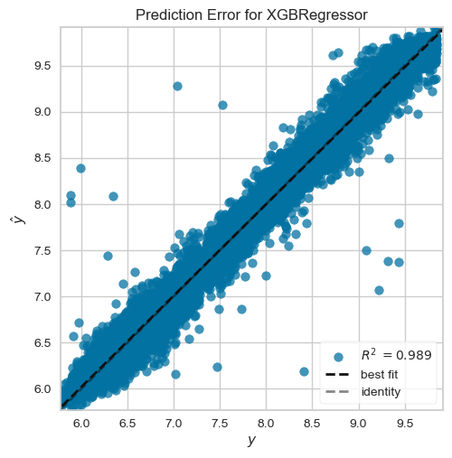

# Diamonds Price Prediction Project 💎

Welcome to the Diamonds Price Prediction Project!

This project aims to help diamond sellers determine prices based on the characteristics of a diamond, ensuring that the sale/purchase price is neither underpriced nor overpriced.

## Objective

To assist diamond sellers in accurately pricing diamonds based on their characteristics.

## Goals

Create a machine learning regression model to predict the price of diamonds.

## Dataset

The dataset used for this project can be found on Kaggle: [Gemstone Dataset](https://www.kaggle.com/datasets/soumyakushwaha/gemstone)

## Variables Explanation

- **id**: Unique identifier
- **carat**: Carat refers to the unique unit of weight measurement used exclusively to weigh gemstones and diamonds.
- **cut**: Quality of the diamond cut.
- **color**: Color of the diamond.
- **clarity**: Diamond clarity is a measure of the purity and rarity of the stone, graded by the visibility of these characteristics under 10-power magnification.
- **depth**: The depth of the diamond is its height (in millimeters) measured from the culet (bottom tip) to the table (top surface).
- **table**: A diamond's table is the facet which can be seen when the stone is viewed face up.
- **x**: Diamond X dimension (length).
- **y**: Diamond Y dimension (width).
- **z**: Diamond Z dimension (height).

## Target

- **price**: The predicted price of the diamond.

## Note

It's important to ensure that the dimensions of the diamond (X, Y, Z) are not zero, as it is physically impossible for a diamond to have a length, width, or height of zero.

## Processing Steps


**Flowchart Explanation**

**Business Problem**: This is the initial stage where you define and understand the business problem or objective that your project aims to solve or achieve.

1. **Data Quality**: In this stage, you focus on assessing and ensuring the quality of your data. This includes tasks such as data cleaning, handling missing values, and checking for outliers.
3. **Eksploratory Data Analytics**: This stage involves exploratory data analysis (EDA), where you explore the dataset to understand its characteristics, distributions, correlations, and patterns. This helps in gaining insights that can guide further steps in the project.
4. **Preprocessing steps**: This is a detailed subgraph that includes various preprocessing tasks:

   - **renew**: This could refer to refreshing or updating data sources if necessary.
   - **con_var**: These are continuous variables selected from the dataset based on specific criteria (not categorical, more than 20 unique values, excluding 'id' and 'price').
   - **cat_var**: These are categorical variables selected based on their data type.
   - **mapping**: Lists (`cut_map`, `clarity_map`, `color_map`) used for mapping categorical variables to numerical representations.
   - **numerical_pipeline**: Pipeline for processing numerical data, including imputation of missing values with median and standard scaling.
   - **cat_pipeline**: Pipeline for processing categorical data, including imputation of missing values with the most frequent value, ordinal encoding using predefined categories (`cut_map`, `color_map`, `clarity_map`), and standard scaling.
   - **processor**: ColumnTransformer that applies the numerical and categorical pipelines to their respective subsets of data (`con_var` and `cat_var`).
5. **Modelling**: This stage involves building and training machine learning models using the preprocessed data to solve the business problem identified earlier.
6. **Evaluation**: After training the models, this stage evaluates their performance using appropriate metrics and techniques to ensure they meet the project's goals and requirements.
7. **Model diagnostics**: In this stage, you perform diagnostics on the trained models to understand their behavior, identify any issues or areas for improvement, and make adjustments as needed.
8. **Deploy to Flask**: This final stage involves deploying your machine learning model(s) as a web application using Flask, a Python web framework. Flask allows you to create endpoints where users can interact with your model through a web interface.


## Eksploratory Data Analytics

### Relationship Carat, Depth and Table to Price


**Insight**:

- Carat weight is a significant factor in determinih diamond prices, with larger diamonds being exponentially more expensive.
- Depth and Table percentage have a minimal impact on diamond prices, indicating that other factors play a more significant role in determining price

### Relation between X,Y,Z dimension and Price


**Insight**:

- All three dimension (x,y,z) show a positive correlation with price, indicating that larger diamonds generally command higher prices.
- The relationship between dimensions and price is not strictly linear, particularly for X and Y, suggesting that larger diamonds are disproportionately more expensive.

### Mean Price By Color


- Color grade significance: The color of diamond significantly impacts its price. Diamonds with higher color grades (closer to D) are considerably more expensive than those with lower color grades (closer to J).

## Mean Price by Clarity and Cut


1. **Clarity's Strong Impact:**

   - **General Trend:** Diamonds with lower clarity grades (more inclusions) such as I1 have lower median prices. As clarity improves (fewer inclusions), the median price of diamonds tends to increase.
   - **Notable Exception:** Clarity grade VS1 shows a relatively higher variation in prices, especially for diamonds with a "Fair" cut, indicating a wider range of prices within this clarity grade.
2. **Cut Grade's Influence:**

   - **Ideal and Premium Cuts:** For most clarity grades, diamonds with "Ideal" and "Premium" cuts generally have higher prices. This highlights the added value of superior cuts, which enhance the diamond's brilliance and appeal.
   - **Variability within Cuts:** Even within the same clarity grade, there is noticeable variability in prices across different cut grades. For example, in clarity grades SI1 and VS2, diamonds with "Very Good" and "Ideal" cuts have similar average prices, indicating that consumers may value both cuts similarly.
3. **Price Fluctuations:**

   - **Fair Cut:** Diamonds with a "Fair" cut consistently have lower prices across all clarity levels, reaffirming that fair-cut diamonds are less desirable due to their poorer light performance.
   - **VVS2 Clarity Grade:** For the VVS2 clarity grade, diamonds with "Premium" and "Ideal" cuts show significant price differences compared to other cuts, indicating a higher premium placed on superior cuts within this clarity grade.
4. **Higher End Clarity Premium:**

   - **VVS1 and IF Grades:** There is a marked price difference between the highest clarity grades (VVS1 and IF) and lower clarity grades. This indicates a premium for diamonds with very few inclusions, reflecting their rarity and desirability.

## Modelling

Base model in XGBregressor with R2 score 0.98 and RMSE Score is $540

## Model Diagnostics

### Residuals Plot


**Residuals Plot (Left Side):**

* **Even Distribution:** The residuals are relatively evenly distributed around the horizontal line at zero. This indicates that the model is unbiased, meaning it's not systematically overpredicting or underpredicting the target variable.
* **Constant Variance:** The spread of the residuals remains relatively consistent across the range of predicted values. This is a good sign as it suggests that the model's accuracy doesn't vary significantly depending on the predicted value.
* **No Obvious Patterns:** There are no clear patterns or trends in the residuals. This indicates that the model has captured the underlying relationship between the predictor variables and the target variable reasonably well.
* **Few Outliers:** There are a few points that are further away from the zero line than the majority of the residuals, suggesting potential outliers in the data. However, these outliers don't seem to significantly impact the model's overall performance.

**Histogram of Residuals (Right Side):**

* **Approximately Normal:** The histogram of the residuals is roughly bell-shaped, indicating that the residuals are approximately normally distributed. This is a desirable property for regression models and helps to validate some statistical assumptions.

### Error Plots



- This plot demonstrates the XGBRegressor model's excellent performance in predicting diamond prices. It accurately captures the relationship between the features (carat, cut, clarity, etc.) and price, with minimal bias and consistent accuracy across different price ranges. This suggests the model is reliable and can be effectively used for diamond price prediction tasks.

## Feature Importance


1. **Carat is Dominant:** The carat feature (weight of the diamond) is by far the most important factor in the model. This aligns with the common understanding that larger diamonds are generally more expensive.
2. **Carat per Volume:**  The second most important feature, "carat_per_volume," is a derived feature likely representing the density of the diamond. This suggests that the concentration of weight within a diamond's size also significantly affects its price. A higher carat per volume might indicate a denser and potentially more valuable diamond.
3. **Other Features Have Minor Impact:** The remaining features—table (width of the top of the diamond relative to its widest point), clarity, color, and cut—have relatively low importance scores. This implies that while these factors do contribute to the price, their influence is much smaller compared to carat and carat per volume.

**Key Takeaways:**

* Carat weight is the primary driver of diamond prices.
* The density of the diamond (carat per volume) plays a substantial secondary role.
* Other factors like cut, clarity, and color have a smaller impact on price compared to carat and density.

**Practical Implications:**

* **Buyers:** Focus on carat weight and carat per volume as the main indicators of a diamond's potential value.
* **Sellers:** Highlight carat weight and any indications of high density to justify a diamond's price.


## Deploy Flask

Deploy in simple web

**Home Page**


**Prediction Page**


## Project Folder

```markdown
├── artifacts               # Directory to store trained models and preprocessed data
│   ├── base_model.pkl      # Saved trained machine learning model
│   ├── preprocessor.pkl    # Saved preprocessor object for data transformation
│   ├── raw.csv             # Raw, unprocessed diamond dataset 
│   ├── test.csv            # Subset of the dataset used for model testing
│   ├── train.csv           # Subset of the dataset used for model training
├── Diamond_Price.egg-info  # Metadata about the project (usually for packaging)
├── images                 # Directory to store images used in the project
├── logs                   # Directory to store log files generated during training/execution
├── notebooks              # Jupyter notebooks for experimentation and analysis
│   └── eda.ipynb          # Exploratory Data Analysis notebook
├── src                    # Source code directory
│   ├── components         # Reusable modules for data ingestion, transformation, etc.
│   │   ├── __init__.py    # Makes the "components" directory a Python package
│   │   ├── data_ingestion.py   # Code for loading and splitting the dataset
│   │   ├── data_transformation.py # Code for preprocessing the data
│   │   └── model_train.py  # Code for training the machine learning model
│   ├── pipelines          # Scripts to orchestrate the entire ML workflow
│   │   ├── __init__.py    # Makes the "pipelines" directory a Python package
│   │   ├── pipeline_train.py # Script to train and evaluate the model pipeline
│   │   └── prediction_pipeline.py # Script for making predictions on new data
│   ├── __init__.py        # Makes the "src" directory a Python package
│   ├── exception.py       # Custom exception handling code
│   ├── logger.py         # Logging configuration and utility functions
│   └── utils.py          # General utility functions used throughout the project
├── templates              # HTML templates for a potential web interface
│   ├── form.html   
│   └── index.html
├── venv                   # Virtual environment to isolate project dependencies
├── .gitignore              # Specifies files/directories to be ignored by Git
├── app.py                 # Main application script (possibly a web server)
├── README.md               # Project description and instructions
├── requirements.txt        # List of required Python packages
└── setup.py                # Setup script for installing the project as a package
```

## How to use ?

```python
1. git clone https://github.com/bayuzen19/DiamondPricePrediction.git
2. pip install -r requirements.txt
3. python app.py
4. open browser and write localhost:5000/predict
```

## Thank You 👍
